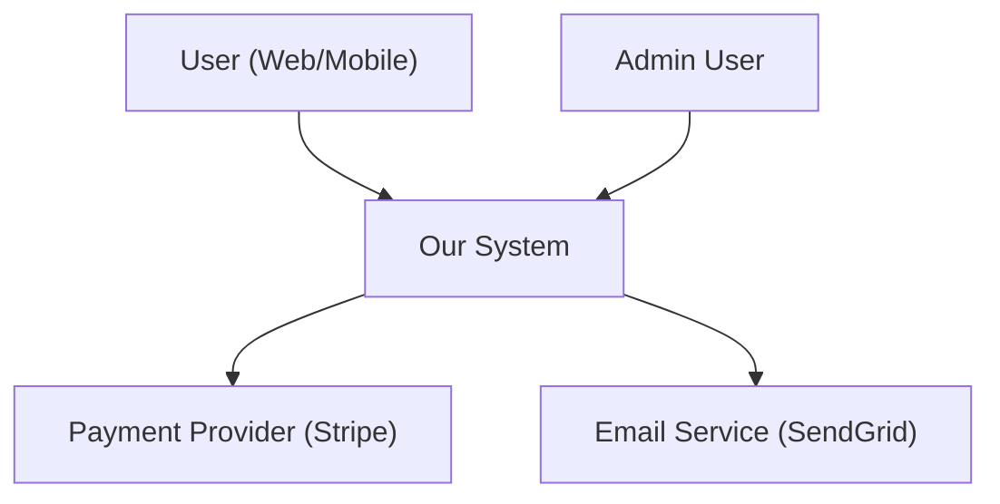
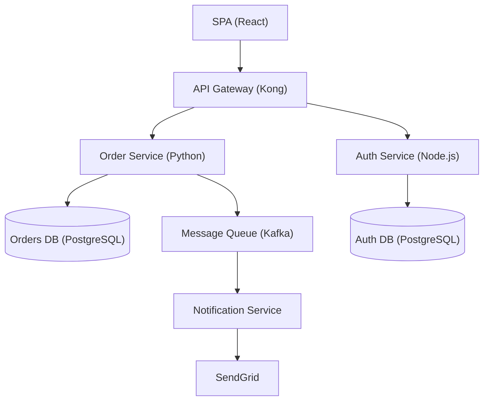
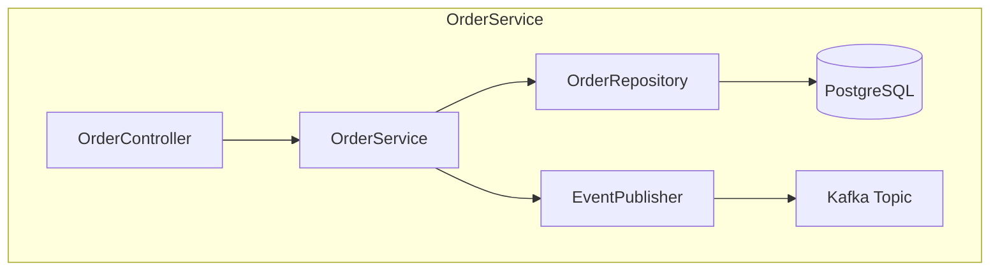

<!-- SUMMARY
Scope: System design, ADRs, C4 diagrams, requirements, microservices, DDD, planning
Capabilities: Architecture with Mermaid, EARS specs, tech stack evaluation, UI wiring gates
Not for: API-specific design (use api-design-pro), infrastructure (use devops-infrastructure)
END SUMMARY -->

# Architecture & Planning

Principal architect skill covering system design, decision records, requirements
engineering, distributed systems, tech evaluation, and plan creation/execution.

## Table of Contents

1. [System Design](#1-system-design)
2. [Architecture Decision Records](#2-architecture-decision-records)
3. [C4 Model Diagrams](#3-c4-model-diagrams)
4. [Requirements & Specifications](#4-requirements--specifications)
5. [Microservices & DDD](#5-microservices--ddd)
6. [Event-Driven & Data Architecture](#6-event-driven--data-architecture)
7. [Planning & Execution](#7-planning--execution)
8. [UI Wiring Gate (Mandatory)](#8-ui-wiring-gate-mandatory)
9. [Tech Stack Evaluation](#9-tech-stack-evaluation)
10. [Architecture Fitness Functions](#10-architecture-fitness-functions)

---

## 1. System Design

### Core Workflow

1. **Gather requirements** -- functional, non-functional, constraints. Use the
   NFR checklist below. Verify full coverage before proceeding.
2. **Select architecture pattern** -- match requirements to patterns.
3. **Design components** -- produce diagrams (Mermaid C4 preferred), document
   trade-offs explicitly.
4. **Write ADRs** -- for every significant decision.
5. **Review** -- validate with stakeholders. If review fails, return to step 3.

### Pattern Selection Matrix

| Requirement | Pattern |
|---|---|
| Simple CRUD, small team (<10) | Monolith |
| Growing complexity, module boundaries | Modular Monolith |
| Independent team deployment, polyglot | Microservices |
| Variable/event-driven load | Serverless |
| Async processing, loose coupling | Event-Driven |
| Read/write ratio heavily skewed | CQRS |
| Full audit trail, temporal queries | Event Sourcing |
| Third-party integration isolation | Hexagonal / Ports & Adapters |

### Architecture Pattern Progression

Start with a modular monolith. Extract services only when:
- A module has significantly different scaling needs
- A team needs independent deployment
- Technology constraints require separation

### Non-Functional Requirements Checklist

Gather these before designing:

| Category | Key Questions |
|---|---|
| **Performance** | API p95 latency? Page load? Batch throughput? |
| **Scalability** | Concurrent users? RPS? Data volume? Growth rate? Peak-to-average? |
| **Availability** | Uptime target (99.9%=8.76h/yr)? RPO? RTO? |
| **Security** | Auth method? AuthZ model? Data classification? Compliance (GDPR, SOC2, HIPAA)? |
| **Reliability** | Backup frequency? DR strategy? |
| **Maintainability** | Deploy frequency? Monitoring needs? On-call model? |
| **Cost** | Infra budget? $/user or $/request? |

### Database Selection Quick Reference

| Need | Choose |
|---|---|
| ACID transactions, complex queries | PostgreSQL |
| Flexible/evolving schema | MongoDB |
| Sub-ms reads, caching, sessions | Redis |
| Time-series, IoT, metrics | TimescaleDB / InfluxDB |
| Graph traversal, social networks | Neo4j |
| Full-text search, logs | Elasticsearch |
| Serverless auto-scale (AWS) | DynamoDB |

### System Design Output Template

```markdown
# System: {Name}

## Requirements
### Functional
- [Core capabilities]

### Non-Functional
- Performance: <target>
- Availability: <target>
- Scalability: <target>
- Security: <requirements>

### Constraints
- Budget, timeline, team size

## Architecture Diagram
[Mermaid C4 diagram -- see Section 3]

## Key Decisions
| Decision | Rationale | ADR |
|----------|-----------|-----|

## Scaling Strategy
### Current (MVP)
### Future (10x)

## Failure Modes
| Failure | Impact | Mitigation |
|---------|--------|------------|
```

---

## 2. Architecture Decision Records

### ADR Template

```markdown
# ADR-{NNN}: {Title}

## Status
[Proposed | Accepted | Deprecated | Superseded by ADR-XXX]

## Context
[Problem, forces, constraints. Why are we deciding?]

## Decision
[The choice, stated clearly.]

## Alternatives Considered
- **{Option}** -- rejected because {reason}. Considered because {strength}.

## Consequences
### Positive
- [Benefit]
### Negative
- [Drawback]
### Neutral
- [Side effect]

## Trade-offs
[What we prioritized and what we accepted as cost.]
```

### ADR File Naming

```
docs/adr/
  0001-use-postgresql-for-orders.md
  0002-adopt-modular-monolith.md
  0003-implement-event-sourcing-for-audit.md
  README.md
```

### When to Write an ADR

- Choosing a database, framework, or cloud provider
- Selecting an architecture pattern
- Adopting a communication protocol (REST vs gRPC vs events)
- Making a build-vs-buy decision
- Changing deployment strategy

---

## 3. C4 Model Diagrams

Use Mermaid for all diagrams. The C4 model has four zoom levels.

### Level 1 -- System Context

Shows the system and its relationships to users and external systems.



### Level 2 -- Container

Shows the high-level technology choices (applications, databases, queues).



### Level 3 -- Component

Shows internal structure of a single container (modules, classes).



### Level 4 -- Code

Use only when explaining a critical algorithm or pattern. Prefer actual code
over diagrams at this level.

### Diagram Conventions

- Label every node with name and technology in parentheses
- Use directional arrows showing data/request flow
- Group related components with `subgraph`
- Include databases as cylinder shapes `[("DB")]`
- Include external systems at the boundary

---

## 4. Requirements & Specifications

### Requirements Workflow

1. **Discover** -- understand feature goal, target users, user value.
2. **Interview** -- systematic questioning from PM and Dev perspectives.
3. **Document** -- write EARS-format functional requirements.
4. **Validate** -- review acceptance criteria with stakeholders.
5. **Plan** -- create implementation checklist.

### EARS Format (Easy Approach to Requirements Syntax)

| Type | Pattern | Example |
|---|---|---|
| Ubiquitous | The system shall {action}. | The system shall encrypt all passwords using bcrypt. |
| Event-driven | When {trigger}, the system shall {action}. | When the user clicks Submit, the system shall save the form. |
| State-driven | While {state}, the system shall {action}. | While logged in, the system shall display the dashboard. |
| Conditional | While {state}, when {trigger}, the system shall {action}. | While cart has items, when user clicks Checkout, the system shall navigate to payment. |
| Optional | Where {feature} is active, the system shall {action}. | Where 2FA is enabled, the system shall require a code. |

### Acceptance Criteria (Given/When/Then)

```
Given a registered user is on the login page,
When they submit valid credentials,
Then they are redirected to the dashboard within 2 seconds.
```

### Specification Template

```markdown
# Feature: {Name}

## Overview
[2-3 sentences: what it does, why it matters]

## Functional Requirements (EARS)
### FR-001: {Name}
While {state}, when {trigger}, the system shall {action}.

## Non-Functional Requirements
[Performance, security, scalability targets]

## Acceptance Criteria
### AC-001: {Scenario}
Given ... When ... Then ...

## Error Handling
| Condition | Code | Message |
|-----------|------|---------|

## Implementation TODO
### Backend
- [ ] ...
### Frontend
- [ ] ...
### Testing
- [ ] ...

## Out of Scope
- [Explicitly excluded items]
```

---

## 5. Microservices & DDD

### Domain-Driven Design Workflow

1. **Event Storming** -- identify domain events, commands, aggregates.
2. **Bounded Contexts** -- group aggregates by ubiquitous language boundaries.
3. **Context Mapping** -- define relationships (upstream/downstream, ACL,
   shared kernel, conformist).
4. **Service Extraction** -- each bounded context becomes a service candidate.

### Bounded Context Indicators

Strong signals for a separate service:
- Different teams own it
- Different release cadences
- Different scaling requirements
- Different optimal tech stack
- Same term means different things across contexts

### Service Sizing

| Signal | Too Small | Right Size | Too Large |
|---|---|---|---|
| Endpoints | 1-2 | 5-15 | 50+ |
| Business logic lines | <100 | 100-1000 | 5000+ |
| Team | fraction of a person | 2-pizza team (5-9) | multiple teams |
| Rewrite time | hours | 2-4 weeks | months |

### Monolith Decomposition (Strangler Fig)

1. Identify seams in existing code
2. Extract leaf dependencies first (no downstream calls)
3. Route through facade/proxy
4. Migrate data per service
5. Decommission old code only when safe

### Communication Patterns

| Pattern | Use When |
|---|---|
| REST | Public APIs, browser clients, CRUD |
| gRPC | Internal service-to-service, low latency, streaming |
| Message Queue (RabbitMQ, SQS) | Task distribution, single consumer, guaranteed delivery |
| Event Stream (Kafka) | Multiple consumers, event replay, high throughput |

**Rule of thumb:** Synchronous for reads and simple writes. Asynchronous for
cross-aggregate workflows. Events for eventually consistent updates. Sagas for
distributed transactions.

### Saga Pattern

**Orchestration** (recommended for most cases):
```
Saga Orchestrator manages steps + compensations:
1. Create Order       -> compensate: Cancel Order
2. Charge Payment     -> compensate: Refund Payment
3. Reserve Inventory  -> compensate: Release Inventory

On failure at step N, execute compensations for steps N-1..1 in reverse.
Each step MUST be idempotent (use saga_id as idempotency key).
```

**Choreography** (for simple flows with few steps):
Services react to domain events. No central orchestrator. Harder to debug as
step count grows.

### Resilience Stack (mandatory for distributed systems)

1. **Timeouts** -- every external call. Connection: 2-5s. Read: 5-30s.
2. **Retries** -- exponential backoff with jitter. Max 3-5 attempts. Only for
   transient errors (503, 429, timeout).
3. **Circuit breakers** -- fail fast when dependency unhealthy. States:
   CLOSED -> OPEN -> HALF_OPEN -> CLOSED.
4. **Bulkheads** -- isolate thread/connection pools per dependency.
5. **Health checks** -- liveness (process alive), readiness (can serve traffic).
6. **Graceful degradation** -- cached responses, defaults, feature toggles.

### Observability Requirements

- Structured logging with correlation IDs propagated across all services
- Distributed tracing (OpenTelemetry / Jaeger / Zipkin)
- Metrics (Prometheus + Grafana or equivalent)
- Alerts integrated with on-call (PagerDuty or equivalent)

---

## 6. Event-Driven & Data Architecture

### Event Sourcing

Store state changes as immutable events. Derive current state by replay.

**Event schema:**
```json
{
  "eventId": "uuid",
  "aggregateId": "order-123",
  "aggregateType": "Order",
  "eventType": "OrderPlaced",
  "eventVersion": "1.0",
  "timestamp": "2025-01-15T10:00:00Z",
  "correlationId": "request-uuid",
  "payload": { "items": ["..."], "total": 99.99 },
  "metadata": { "userId": "user-789" }
}
```

**Snapshots:** Periodically snapshot aggregate state (every ~100 events) to
avoid replaying full history on every read.

**Schema evolution:** Use event versioning + upcasting. Never mutate stored
events. Transform old formats to new during replay.

### CQRS

Separate write model (commands, validation, event store) from read model
(denormalized views optimized for queries). Read models are eventually consistent
projections built from the event stream.

Multiple read models from the same events:
- Customer-facing order detail view
- Admin order list view
- Analytics aggregation view

### Data Mesh Patterns

For organizations where data ownership is distributed across domains:

| Principle | Implementation |
|---|---|
| **Domain ownership** | Each team owns and publishes its data products |
| **Data as a product** | SLAs, documentation, discoverability for each dataset |
| **Self-serve platform** | Shared infrastructure for data pipelines, catalogs, governance |
| **Federated governance** | Cross-domain standards for interoperability, security, quality |

**Data product interface:**
- Input ports: APIs, event streams, bulk ingestion
- Output ports: query APIs, event streams, materialized views, exports
- Discovery: data catalog with schema, ownership, freshness, quality metrics

### Event-Driven Architecture (beyond microservices)

Apply event-driven patterns at any scale:

| Pattern | Use Case |
|---|---|
| **Event Notification** | Lightweight: publish that something happened, consumers fetch details |
| **Event-Carried State Transfer** | Events carry full state so consumers avoid callbacks |
| **Event Sourcing** | Events are the system of record |
| **CDC (Change Data Capture)** | Database transaction log -> event stream (Debezium) |

**Event design principles:**
- Past-tense naming (`order.placed`, not `place.order`)
- Immutable once published
- Schema-versioned for backward compatibility
- Minimal but sufficient payload (avoid chatty callbacks, avoid bloated events)
- Include correlationId for end-to-end tracing

### Data Consistency Spectrum

| Level | Mechanism | Use When |
|---|---|---|
| Strong | Saga with compensation | Financial transactions, inventory |
| Causal | Logical clocks, version vectors | Social feeds, collaborative editing |
| Eventual | Async events, CDC | Analytics, search indexes, caches |

### Data Synchronization Patterns

- **API Composition** -- gateway joins responses from multiple services at
  query time. Simple but adds latency.
- **Event-driven replication** -- services denormalize data locally by
  consuming events. Fast reads, eventual consistency.
- **CQRS read models** -- dedicated query database built from event streams.
- **CDC (Debezium)** -- capture database changes without application code
  modifications. Good for legacy integration.

---

## 7. Planning & Execution

### Writing Implementation Plans

**When:** Multi-step feature requiring coordination across files or services.

**Plan document structure:**

```markdown
# {Feature} Implementation Plan

**Goal:** [One sentence]
**Architecture:** [2-3 sentences on approach]
**Tech Stack:** [Key technologies]

---

## File Structure
[Which files will be created/modified and their responsibilities]

### Task 1: {Component}
**Files:**
- Create: `exact/path/to/file.py`
- Modify: `exact/path/to/existing.py:123-145`
- Test: `tests/exact/path/to/test.py`

- [ ] Step 1: Write the failing test
- [ ] Step 2: Run test -- verify it fails
- [ ] Step 3: Write minimal implementation
- [ ] Step 4: Run test -- verify it passes
- [ ] Step 5: Commit
```

**Plan quality rules:**
- Every step is one action (2-5 minutes)
- Exact file paths, complete code, exact commands with expected output
- TDD sequence: RED -> GREEN -> REFACTOR -> COMMIT
- DRY, YAGNI, frequent commits
- If plan covers multiple independent subsystems, split into separate plans

**Plan review loop:**
1. Write complete plan
2. Review for gaps, ordering issues, missing tests
3. If issues found, fix and re-review
4. Max 3 review iterations before escalating to human

### Executing Plans

1. **Load and review** -- read plan, identify concerns, raise blockers before
   starting.
2. **Execute tasks** -- mark in-progress, follow steps exactly, run
   verifications, mark completed.
3. **Stop on blockers** -- missing dependency, unclear instruction, repeated
   verification failure. Ask rather than guess.
4. **Complete** -- verify all tests pass, run final checks.

**Never start implementation on main/master without explicit consent.**

---

## 8. UI Wiring Gate (Mandatory)

Every plan that includes a user-facing feature MUST define a **UI Wiring Gate** --
a checklist of UI surfaces that must exist before the sprint/task can close.

### Rules

1. **Every plan output must include a UI Wiring Gate section.** List the specific
   UI surfaces (pages, modals, form fields, status indicators, error states) that
   must be wired for the feature to count as delivered.
2. **No feature without a UI surface.** If a feature has no defined UI surface,
   the planner must flag it and require one before proceeding. Pure backend work
   without a UI entry point is infrastructure, not a feature.
3. **Interleave layers -- never finish backend before touching UI.** Follow this
   order: model/schema -> endpoint stub -> UI skeleton -> flesh out backend ->
   flesh out UI -> integration test. This prevents the "backend 95%, UI 0%"
   failure mode.
4. **Low-context priority rule.** When context window is running low, prioritize
   wiring UI to the backend work just completed over starting new backend tasks.
   A half-finished feature with UI wired is shippable; a finished backend with
   no UI is not.
5. **Backend-only delivery is infrastructure, not a feature.** A task is not
   "done" until the user can interact with it. Plans and reviews must enforce
   this -- mark tasks incomplete if UI wiring is missing.

### Plan Template Addition

```markdown
## UI Wiring Gate
| UI Surface | Status | Wired To |
|------------|--------|----------|
| [Page/component/modal] | [ ] | [endpoint/model] |
```

---

## 9. Tech Stack Evaluation

### Evaluation Workflow

1. **Define requirements** -- must-haves, nice-to-haves, constraints.
2. **Identify candidates** -- 2-4 options maximum.
3. **Score with weighted criteria** -- adjust weights to project priorities.
4. **Calculate TCO** -- 3-5 year projection including hidden costs.
5. **Assess ecosystem health** -- GitHub activity, community, corporate backing.
6. **Evaluate security** -- CVE history, compliance readiness.
7. **Document decision** -- ADR with full rationale.

### Weighted Scoring Matrix

| Category | Default Weight | Adjust Higher When |
|---|---|---|
| Developer Experience | 20% | Tight timeline, team retention critical |
| Performance | 15% | Latency-sensitive workload |
| Scalability | 15% | High-growth product |
| Ecosystem | 15% | Long-term maintenance concern |
| Learning Curve | 10% | New team, tight deadline |
| Documentation | 10% | Junior-heavy team |
| Community Support | 10% | Niche problem domain |
| Enterprise Readiness | 5% | Regulated industry |

### TCO Calculation

```
Initial Costs (one-time):
  + Licensing + Training + Migration + Setup/tooling

Annual Costs (recurring):
  + Hosting * (1 + growth_rate)^(year - 1)
  + Licensing renewals + Support contracts
  + Maintenance hours * hourly_rate * 12

5-Year TCO = Initial + Sum(Annual costs, years 1-5)
ROI = (Productivity gains - Total cost) / Total cost * 100
```

### Ecosystem Health Signals

| Signal | Healthy | Concerning |
|---|---|---|
| GitHub commits/month | 50+ | <10 |
| Contributors | 100+ | <20 |
| npm weekly downloads | 100K+ | <10K |
| Days since last publish | <90 | >365 |
| Corporate backing | Major company or strong foundation | Single maintainer |

### Migration Risk Assessment

| Factor | Weight | Score 1-10 |
|---|---|---|
| Code changes (LOC affected) | 30% | |
| Architecture impact (breaking changes) | 25% | |
| Data migration complexity | 25% | |
| Downtime requirements | 20% | |

Multiply each score by weight, sum for composite risk score. Add 20-30% buffer
to effort estimates for unknowns.

---

## 10. Architecture Fitness Functions

Automated checks that validate architecture characteristics over time. Run in
CI/CD to prevent architectural drift.

### What Fitness Functions Measure

| Characteristic | Fitness Function | Tool / Approach |
|---|---|---|
| **Modularity** | No circular dependencies between modules | dependency-cruiser, Go vet, ArchUnit |
| **Layering** | No layer violations (e.g., controller importing repository) | ArchUnit, custom lint rules |
| **Coupling** | Afferent/efferent coupling below threshold | dependency analysis tools |
| **Performance** | p95 latency < threshold in load tests | k6, Locust, Gatling in CI |
| **Scalability** | Throughput scales linearly with instances | benchmark suite in CI |
| **Security** | No high/critical CVEs in dependencies | Snyk, Dependabot, Trivy |
| **Data isolation** | No cross-service database access | SQL lint, schema ownership checks |
| **API compatibility** | No breaking changes to published APIs | openapi-diff, buf breaking (gRPC) |
| **Deployment independence** | Each service deploys without coordinating with others | CI pipeline structure |
| **Test coverage** | Coverage >= 80% per service | coverage tools in CI gate |

### Implementing Fitness Functions

**Static (build-time):**
```bash
# Dependency rule: controllers must not import repositories
npx dependency-cruiser --validate .dependency-cruiser.cjs src/

# API breaking change detection
openapi-diff old-spec.yaml new-spec.yaml --fail-on-incompatible

# Layer violation check (Java/Kotlin with ArchUnit)
# services must not depend on controllers
```

**Dynamic (runtime/deploy-time):**
```bash
# Performance fitness: p95 must stay below 200ms
k6 run --out json=results.json load-test.js
# Parse results.json, fail CI if p95 > 200ms

# Chaos fitness: service survives dependency failure
# Kill dependency, verify graceful degradation
```

**Governance dashboard:**
Track fitness function results over time. Alert on regressions. Review trends
in architecture review meetings.

### When to Add Fitness Functions

- When adopting a new architecture pattern (validate it stays true)
- After an architectural incident (prevent recurrence)
- When onboarding new teams (enforce boundaries automatically)
- During monolith-to-microservices migration (verify decoupling progress)

---

## Constraints

### MUST DO

- Document all significant decisions with ADRs
- Gather NFRs explicitly before designing
- Evaluate trade-offs, not just benefits
- Plan for failure modes and graceful degradation
- Consider operational complexity and team capacity
- Use TDD in implementation plans (RED-GREEN-REFACTOR)
- Propagate correlation IDs across all services
- Validate architecture fitness in CI/CD

### MUST NOT DO

- Over-engineer for hypothetical scale
- Choose technology without evaluating alternatives
- Share databases between microservices
- Use synchronous calls for long-running cross-service operations
- Skip security considerations or observability
- Write implementation plans without exact file paths and test steps
- Force through blockers instead of asking for clarification
