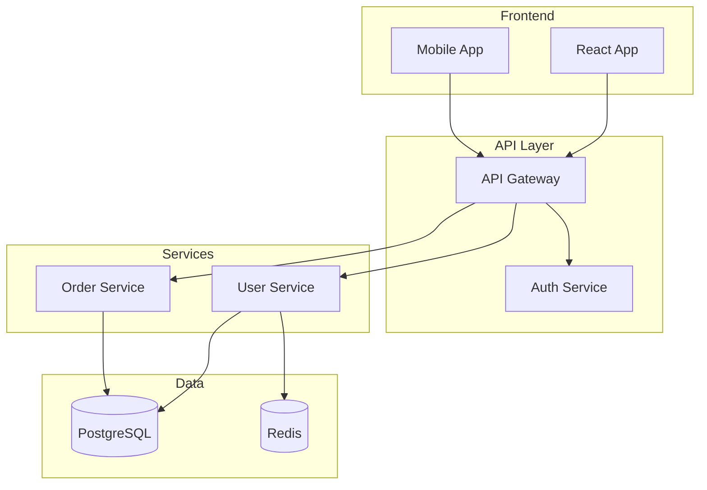
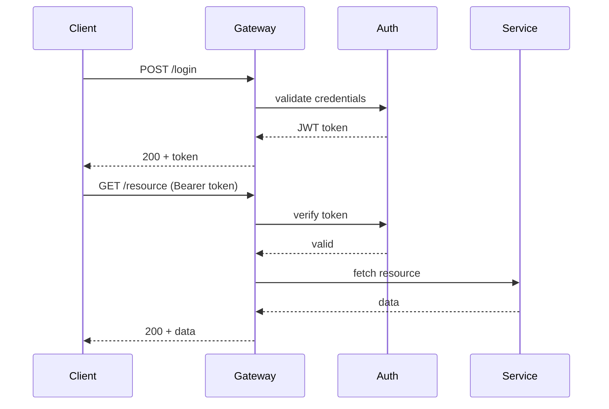

<!-- SUMMARY
Scope: Inline docs, API specs, onboarding, runbooks, changelogs, ADRs, spec mining
Capabilities: JSDoc/NumPy docstrings, OpenAPI, Mermaid diagrams, EARS reverse-engineering
Not for: Code comments in reviews (use code-review-suite), architecture (use architecture-planning)
END SUMMARY -->

# Documentation Suite

Unified documentation specialist covering every stage of a project's documentation lifecycle --
from reverse-engineering undocumented code to generating changelogs for each release.

## When to Use This Skill

| Need | Section |
|------|---------|
| Add docstrings / JSDoc to code | Inline Documentation |
| Create or update OpenAPI specs | API Specification |
| Generate architecture / sequence / ER diagrams | Diagram-as-Code |
| Onboard a new team member or contractor | Onboarding Documentation |
| Create or refresh an operational runbook | Runbook Generation |
| Automate changelogs or release notes | Changelog and Release Notes |
| Record an architectural decision | Architecture Decision Records |
| Understand legacy / undocumented code | Spec Mining |
| Build a doc site (Docusaurus, MkDocs, VitePress) | Documentation Site |

---

## Core Workflow

Every documentation task follows the same loop:

1. **Discover** -- Ask the user for format preferences, audience, and scope.
2. **Detect** -- Identify language, framework, and existing doc conventions.
3. **Analyze** -- Explore the codebase (Glob, Grep, Read) to find gaps.
4. **Document** -- Apply the correct template from the sections below.
5. **Validate** -- Test examples compile/run; lint specs; verify commands.
6. **Report** -- Summarize coverage, gaps, and next steps.

---

## 1. Inline Documentation

### Supported Formats

Ask the user which style to use before starting. Never assume.

**Google-style (Python)**
```python
def fetch_user(user_id: int, active_only: bool = True) -> dict:
    """Fetch a single user record by ID.

    Args:
        user_id: Unique identifier for the user.
        active_only: When True, raise an error for inactive users.

    Returns:
        A dict containing user fields (id, name, email, created_at).

    Raises:
        ValueError: If user_id is not a positive integer.
        UserNotFoundError: If no matching user exists.
    """
```

**NumPy-style (Python)**
```python
def compute_similarity(vec_a: np.ndarray, vec_b: np.ndarray) -> float:
    """Compute cosine similarity between two vectors.

    Parameters
    ----------
    vec_a : np.ndarray
        First input vector, shape (n,).
    vec_b : np.ndarray
        Second input vector, shape (n,).

    Returns
    -------
    float
        Cosine similarity in the range [-1, 1].

    Raises
    ------
    ValueError
        If vectors have different lengths.
    """
```

**JSDoc (TypeScript)**
```typescript
/**
 * Fetches a paginated list of products from the catalog.
 *
 * @param categoryId - The category to filter by.
 * @param page - Page number (1-indexed). Defaults to 1.
 * @param limit - Maximum items per page. Defaults to 20.
 * @returns Resolves to a page of product records.
 * @throws {NotFoundError} If the category does not exist.
 *
 * @example
 * const page = await fetchProducts('electronics', 2, 10);
 */
async function fetchProducts(
  categoryId: string,
  page = 1,
  limit = 20
): Promise<ProductPage> { ... }
```

### Validation

- Python: `python -m doctest file.py` or `pytest --doctest-modules`
- TypeScript: `tsc --noEmit` to confirm typed examples compile
- OpenAPI: `npx @redocly/cli lint openapi.yaml`

If validation fails, fix examples and re-validate before reporting.

### Coverage Report

After documenting, output a summary table:

| Metric | Count | Percentage |
|--------|-------|------------|
| Public functions documented | X / Y | Z% |
| Public classes documented | X / Y | Z% |
| Missing docstrings | list | -- |

---

## 2. API Specification

### OpenAPI 3.1 Quick Template

```yaml
openapi: 3.1.0
info:
  title: ${API_TITLE}
  version: ${VERSION}
  description: |
    ${DESCRIPTION}
servers:
  - url: https://api.example.com/v1
    description: Production
paths:
  /resources:
    get:
      operationId: listResources
      summary: List resources
      parameters:
        - $ref: "#/components/parameters/PageParam"
        - $ref: "#/components/parameters/LimitParam"
      responses:
        "200":
          description: OK
          content:
            application/json:
              schema:
                $ref: "#/components/schemas/ResourceList"
        "401":
          $ref: "#/components/responses/Unauthorized"
components:
  schemas: {}
  securitySchemes:
    bearerAuth:
      type: http
      scheme: bearer
      bearerFormat: JWT
security:
  - bearerAuth: []
```

### Design Approaches

| Approach | When |
|----------|------|
| Design-first | New APIs, contract-driven development |
| Code-first | Existing APIs (FastAPI, NestJS, tsoa auto-generate) |
| Hybrid | Evolving APIs with annotated code |

### Linting and Validation

```bash
# Spectral
npx @stoplight/spectral-cli lint openapi.yaml

# Redocly
npx @redocly/cli lint openapi.yaml
npx @redocly/cli preview-docs openapi.yaml
```

### SDK Generation

```bash
npx @openapitools/openapi-generator-cli generate \
  -i openapi.yaml -g typescript-fetch -o ./generated/ts-client
```

---

## 3. Diagram-as-Code

Generate Mermaid diagrams directly from codebase analysis. Always provide both
a basic and a styled version. Keep diagrams readable -- avoid overcrowding.

### Supported Diagram Types

`graph` (flowchart), `sequenceDiagram`, `classDiagram`, `stateDiagram-v2`,
`erDiagram`, `gantt`, `pie`, `gitGraph`, `journey`, `timeline`

### System Architecture Example



### Sequence Diagram Example



### When to Diagram

- New service added or removed
- Data flow changes
- Onboarding documentation
- Architecture decision records (embed in the ADR)

---

## 4. Onboarding Documentation

### Workflow

1. Explore the repo: top-level structure, config files, detected languages.
2. Fill the template below, tailored to audience:
   - **Junior**: setup + guardrails + "where to start reading"
   - **Senior**: architecture + ADRs + performance/security notes
   - **Contractor**: scoped ownership + integration boundaries

### Onboarding Template

```markdown
# [Project Name]

> One-sentence description of what this does and who uses it.

## Quick Start (target: under 10 minutes)

### Prerequisites
| Tool | Version | Install |
|------|---------|---------|
| ... | ... | ... |

### Setup
(copy-paste commands, every step verifiable)

### Verify It Works
- [ ] App loads on localhost
- [ ] Health endpoint returns OK
- [ ] Tests pass

## Architecture
(diagram + tech stack table with "why" column)

## Key Files
| Path | Purpose |
|------|---------|
| ... | ... |

## Common Developer Tasks
(add endpoint, run migration, add background job)

## Debugging Guide
(common errors, useful queries, log locations)

## Contribution Guidelines
(branch strategy, PR requirements, commit convention)
```

### Best Practices

- Keep setup instructions executable and time-bounded.
- Document the "why" for key architectural decisions.
- Update docs in the same PR as behavior changes.
- Treat onboarding docs as living operational assets.

---

## 5. Runbook Generation

### Workflow

1. Generate skeleton from service name and codebase analysis.
2. Fill in service-specific commands, URLs, and thresholds.
3. Add verification checks after every critical step.
4. Dry-run in staging.
5. Store in version control near service code.

### Runbook Skeleton

```markdown
# Runbook: [Service Name]

**Owner:** [team]
**Last verified:** [date]

## Service Overview
- Purpose, dependencies, SLOs

## Health Checks
- `curl https://service/health` -- expected: `{"status":"ok"}`

## Start / Stop / Restart
1. Command
2. Expected output
3. Verification

## Deployment
### Pre-deployment
- [ ] Tests green
- [ ] Config diff reviewed

### Deploy Steps
1. Command with expected output
2. Smoke test

### Rollback
**Trigger:** [when to rollback]
1. Rollback command
2. Verification

## Incident Response
### Triage (first 5 minutes)
- Check dashboards, recent deploys, alerts

### Diagnosis
- Log locations, key metrics, common failure modes

### Escalation
| Severity | Contact | Channel |
|----------|---------|---------|
| P1 | on-call | #incidents |
| P2 | team lead | #team |

## Database Maintenance
- Backup verification
- Migration sequencing and lock-risk notes
- Vacuum/reindex routines
```

### Quarterly Validation Checklist

1. Execute commands in staging.
2. Validate expected outputs.
3. Test rollback paths.
4. Confirm contact/escalation ownership.
5. Update "Last verified" date.

---

## 6. Changelog and Release Notes

### Keep a Changelog Format

```markdown
# Changelog

## [Unreleased]

### Added
- New feature X

## [1.2.0] - 2024-01-15

### Added
- User profile avatars

### Changed
- Improved loading performance by 40%

### Fixed
- Login timeout issue (#123)

### Security
- Updated dependencies for CVE-2024-1234
```

### Conventional Commits Mapping

| Type | Changelog Section |
|------|-------------------|
| `feat` | Added |
| `fix` | Fixed |
| `perf` | Changed |
| `refactor` | Changed |
| `revert` | Removed |
| `feat!` / `BREAKING CHANGE` | Breaking Changes |
| `docs`, `style`, `test`, `chore`, `ci` | Usually excluded |

### Automation Tools

| Tool | Ecosystem | Key Command |
|------|-----------|-------------|
| standard-version | Node.js | `npx standard-version` |
| semantic-release | Node.js (full CI) | `npx semantic-release` |
| git-cliff | Rust-based, fast | `git cliff -o CHANGELOG.md` |
| commitizen | Python | `cz bump --changelog` |

### GitHub Release Notes Template

```markdown
## What's Changed

### Features
- Feature description by @author in #PR

### Bug Fixes
- Fix description by @author in #PR

### Breaking Changes
- Description and migration guide

**Full Changelog**: https://github.com/org/repo/compare/vPREV...vCURR
```

---

## 7. Architecture Decision Records

### When to Write an ADR

| Write ADR | Skip ADR |
|-----------|----------|
| New framework adoption | Minor version upgrades |
| Database technology choice | Bug fixes |
| API design patterns | Implementation details |
| Security architecture | Routine maintenance |

### ADR Lifecycle

```
Proposed -> Accepted -> Deprecated -> Superseded
               |
            Rejected
```

### Standard ADR Template (MADR)

```markdown
# ADR-NNNN: [Title]

## Status
Proposed | Accepted | Deprecated | Superseded by ADR-XXXX

## Context
[Why we need to decide. Include constraints and requirements.]

## Decision Drivers
- [Must-have / should-have criteria]

## Considered Options
### Option 1: [Name]
- Pros: ...
- Cons: ...

### Option 2: [Name]
- Pros: ...
- Cons: ...

## Decision
We will use **[chosen option]**.

## Rationale
[Why this option wins against the criteria.]

## Consequences
### Positive
- ...
### Negative
- ...
### Risks and Mitigations
- ...

## Related Decisions
- ADR-XXXX: [title]
```

### Y-Statement Shorthand

> In the context of **[situation]**, facing **[concern]**,
> we decided for **[option]** and against **[alternatives]**,
> to achieve **[goal]**, accepting that **[trade-off]**.

### Management

```bash
# Using adr-tools
brew install adr-tools
adr init docs/adr
adr new "Title of Decision"
adr new -s 3 "Supersede ADR-0003"
adr generate toc > docs/adr/README.md
```

---

## 8. Spec Mining (Reverse Engineering)

For undocumented or legacy codebases. Operates with two perspectives:
**Arch Hat** (system architecture, data flows) and **QA Hat** (observable behaviors, edge cases).

### Workflow

1. **Scope** -- Identify analysis boundaries (full system or specific feature).
2. **Explore** -- Map structure with Glob, Grep, Read.
   - Validation checkpoint: confirm sufficient file coverage before writing.
3. **Trace** -- Follow data flows and request paths.
4. **Document** -- Write observed requirements in EARS format.
5. **Flag** -- Mark areas needing clarification.

### Exploration Patterns

```bash
# Entry points and public interfaces
Glob('**/*.py', exclude=['**/test*', '**/__pycache__/**'])

# Technical debt markers
Grep('TODO|FIXME|HACK|XXX', include='*.py')

# Configuration and environment usage
Grep('os\.environ|config\[|settings\.', include='*.py')

# API route definitions
Grep('@app\.route|@router\.|router\.get|router\.post', include='*.py')
```

### EARS Format Quick Reference

| Type | Pattern | Example |
|------|---------|---------|
| Ubiquitous | The system shall [action]. | The API shall return JSON responses. |
| Event-driven | When [trigger], the system shall [action]. | When a request lacks auth, the system shall return 401. |
| State-driven | While [state], the system shall [action]. | While in maintenance mode, the system shall reject writes. |
| Conditional | While [state], when [trigger], the system shall [action]. | While admin, when DELETE is called, the system shall soft-delete. |
| Optional | Where [feature] is supported, the system shall [action]. | Where caching is enabled, the system shall store responses for 60s. |

### Output Template

Save as `specs/{project_name}_reverse_spec.md`:

```markdown
# Reverse-Engineered Specification: [System Name]

## Architecture Summary
- Technology stack, module structure, data flow diagram

## Observed Functional Requirements
(EARS format, grouped by module, with code locations)

## Observed Non-Functional Requirements
- Security, performance, error handling patterns

## Inferred Acceptance Criteria
(Given/When/Then format)

## Uncertainties and Questions
- [ ] Items requiring human clarification

## Recommendations
- Gaps, missing validation, suggested improvements
```

### Constraints

- Ground ALL observations in actual code evidence.
- Distinguish between observed facts and inferences.
- Include file paths and line numbers for each observation.
- Never skip security pattern analysis.

---

## 9. Documentation Site

### Static Site Generators

| Generator | Language | Best For |
|-----------|----------|----------|
| Docusaurus | React/JS | Full developer portals |
| MkDocs + Material | Python | Clean reference docs |
| VitePress | Vue/JS | Lightweight, fast |

### CI/CD for Docs

```yaml
# .github/workflows/docs.yml
name: Deploy Documentation
on:
  push:
    branches: [main]
    paths: ["docs/**", "src/**"]
jobs:
  deploy:
    runs-on: ubuntu-latest
    steps:
      - uses: actions/checkout@v4
      - run: npm ci
      - run: npm run docs:build
      - uses: peaceiris/actions-gh-pages@v3
        with:
          github_token: ${{ secrets.GITHUB_TOKEN }}
          publish_dir: ./docs/build
```

### Documentation Coverage CI Gate

Add a step that fails the build if doc coverage drops below threshold:

```bash
# Example: Python doc coverage check
python -c "
import ast, glob, sys
total = documented = 0
for f in glob.glob('src/**/*.py', recursive=True):
    tree = ast.parse(open(f).read())
    for node in ast.walk(tree):
        if isinstance(node, (ast.FunctionDef, ast.AsyncFunctionDef, ast.ClassDef)):
            if not node.name.startswith('_'):
                total += 1
                if ast.get_docstring(node):
                    documented += 1
pct = (documented / total * 100) if total else 100
print(f'Doc coverage: {documented}/{total} ({pct:.0f}%)')
sys.exit(0 if pct >= 80 else 1)
"
```

---

## Constraints

### MUST DO

- Ask for format preference before starting inline docs
- Detect framework for correct API doc strategy
- Document all public functions, classes, and endpoints
- Include parameter types, descriptions, and error cases
- Test all code examples in documentation
- Generate a coverage report after documenting
- Ground spec-mining observations in actual code evidence
- Keep runbook commands copy-pasteable with expected outputs

### MUST NOT DO

- Assume docstring format without asking
- Apply wrong API doc strategy for the detected framework
- Write inaccurate or untested documentation
- Skip error documentation or security patterns
- Document obvious getters/setters verbosely
- Make spec-mining assumptions without code evidence
- Write runbook steps without verification checks

---

## Output Formats

Depending on the task, provide one or more of:

1. **Code Documentation** -- Documented files + coverage report
2. **API Docs** -- OpenAPI spec + portal configuration
3. **Diagrams** -- Mermaid code blocks (basic + styled versions)
4. **Onboarding Guide** -- Structured markdown with audience-specific sections
5. **Runbook** -- Operational playbook with rollback and escalation
6. **Changelog** -- Keep a Changelog format or GitHub release notes
7. **ADR** -- Decision record in MADR or Y-statement format
8. **Reverse Spec** -- EARS-format specification with uncertainties section
9. **Doc Site** -- Site config + content structure + build/deploy instructions